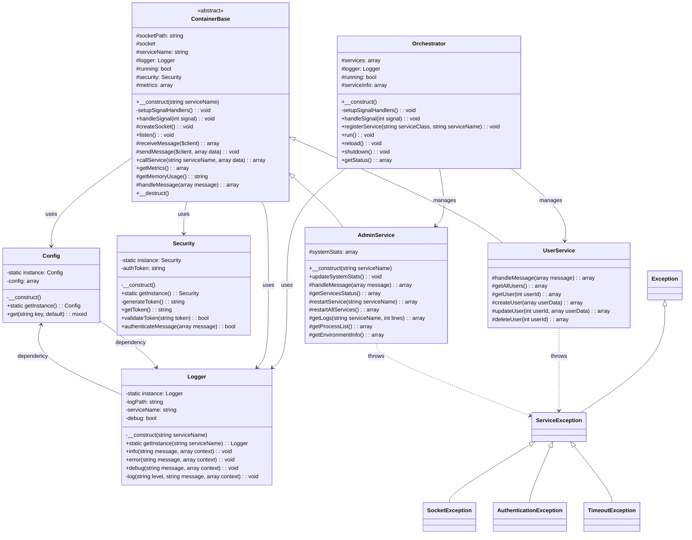
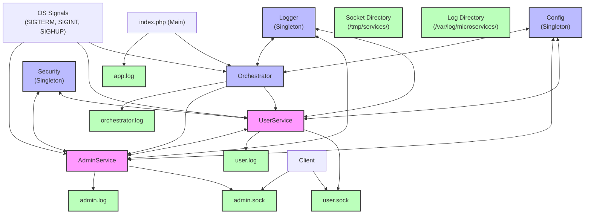
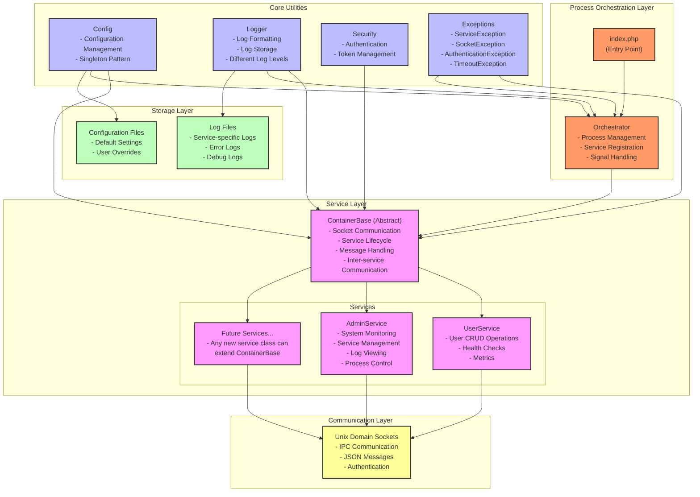
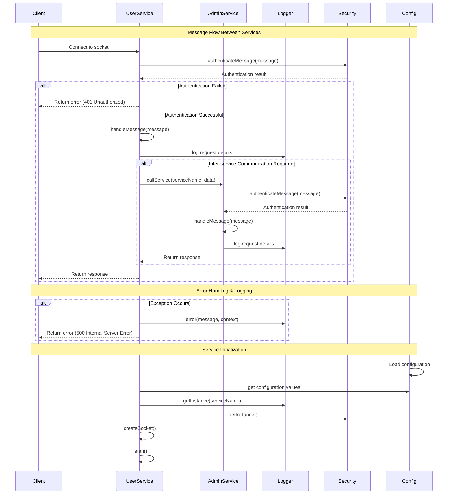

# PHP Unix Socket Container Architecture

A lightweight microservices architecture implementation using PHP and Unix sockets for inter-service communication.

## Overview

This project demonstrates a containerized microservice architecture where each service runs in an isolated environment and communicates with other services via Unix sockets. The architecture provides a simple yet effective way to build modular, scalable applications using PHP without the overhead of HTTP-based communication.

## Key Features

- **Containerized Services**: Each service runs in its own isolated process
- **Unix Socket Communication**: Fast, efficient inter-service communication
- **Process-based Orchestration**: Simple orchestration of multiple services
- **JSON-based Messaging**: Standardized message format for service communication
- **Automatic Service Discovery**: Services can easily locate and communicate with each other

## Architecture Components

### ContainerBase

The foundation class for all services providing:
- Unix socket creation and management
- Message handling interface
- Inter-service communication capabilities
- Resource cleanup on shutdown

### Service Implementations

The project includes two example services:

1. **UserService**
    - Manages user data
    - Supports operations: get, list, create

2. **OrderService**
    - Manages order data
    - Supports operations: get, list, create
    - Demonstrates inter-service communication by fetching user details

### Orchestrator

Manages the lifecycle of all services:
- Service registration and initialization
- Process forking to isolate services
- Signal handling for graceful shutdown
- Process monitoring

## Installation

1. Clone the repository
2. Ensure PHP is installed with the following extensions:
    - `pcntl`
    - `posix`
    - `sockets`

## Usage

Run the main script to start all services:

```bash
php container_architecture.php
```

To stop the application, press `Ctrl+C` for graceful shutdown.

## Example Service Communication

Services use a standard JSON-based message format:

```php
// Request
$request = [
    'action' => 'get',
    'userId' => 1
];

// Response
$response = [
    'status' => 'success',
    'data' => [
        'id' => 1,
        'name' => 'Ali',
        'email' => 'ali@example.com'
    ]
];
```

## Extending the Architecture

To add a new service:

1. Create a new class extending `ContainerBase`
2. Implement the `handleMessage()` method to process incoming messages
3. Register the service with the Orchestrator

Example:

```php
class ProductService extends ContainerBase {
    protected function handleMessage($message) {
        // Handle service-specific messages
    }
}

// Register with orchestrator
$orchestrator->registerService('ProductService');
```

## Benefits Over HTTP-based Microservices

- **Lower Latency**: Direct socket communication is faster than HTTP
- **Reduced Overhead**: No need for HTTP servers, routers, etc.
- **Simplified Authentication**: Services operate in a trusted environment
- **Resource Efficiency**: Lightweight communication suitable for resource-constrained environments

## Limitations

- Services must run on the same physical host or share a volume for socket files
- Limited to PHP applications
- Requires `pcntl` and other extensions not available in all PHP environments








