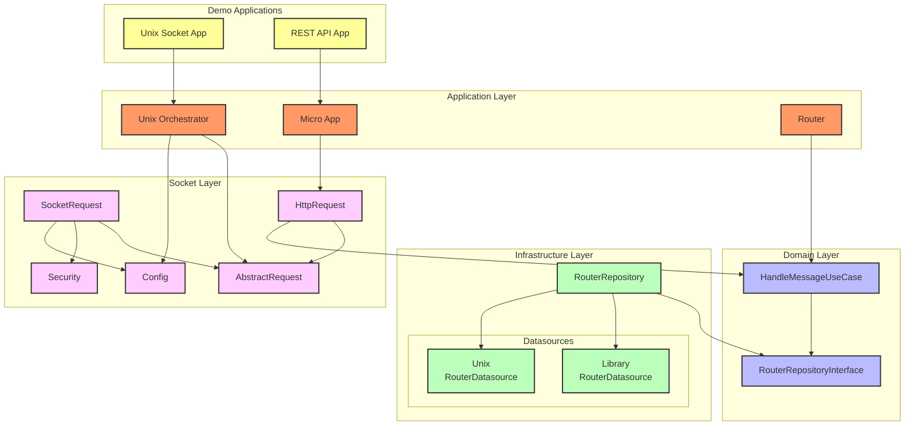
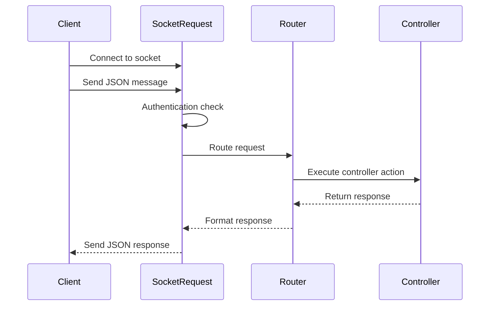
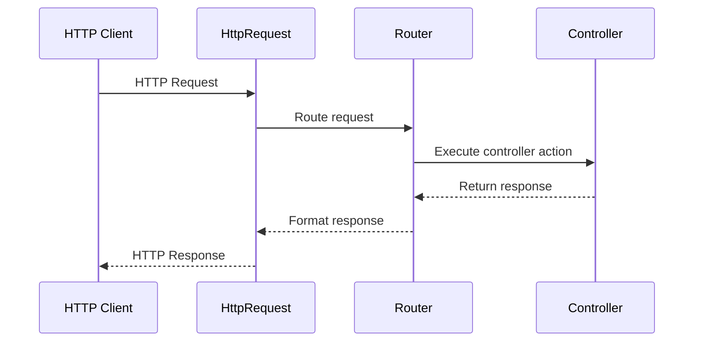
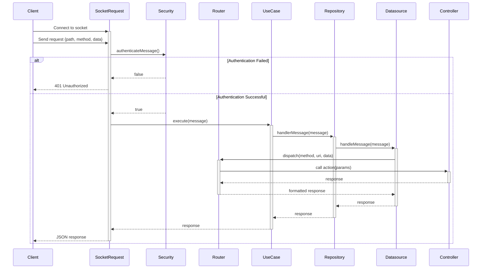

# PHP Unix Socket Microservices Architecture

A powerful, lightweight microservices framework using PHP and Unix sockets for ultra-fast inter-service communication. This architecture provides a robust foundation for building modular, scalable applications with minimal overhead.

## 📋 Table of Contents

- [Core Features](#core-features)
- [Architecture Overview](#architecture-overview)
- [Directory Structure](#directory-structure)
- [Core Components](#core-components)
- [Application Demos](#application-demos)
  - [Unix Socket App](#unix-socket-app)
  - [REST API App](#rest-api-app)
- [Communication Flow](#communication-flow)
- [Security](#security)
- [Performance Considerations](#performance-considerations)
- [Installation & Setup](#installation--setup)
- [Usage Examples](#usage-examples)
- [Extending the Framework](#extending-the-framework)
- [Deployment with Docker](#deployment-with-docker)
- [Troubleshooting](#troubleshooting)

## 🚀 Core Features

- **High-Performance Socket Communication**: Achieve microsecond-level latency between services
- **Process-based Isolation**: Each service runs in its own protected process environment
- **Robust Error Handling**: Comprehensive exception hierarchy with detailed logging
- **Clean Domain-Driven Design**: Separation of concerns with repository pattern
- **Dependency Injection**: PHP-DI integration for flexible service management
- **Signal Handling**: Graceful service shutdown and reload capabilities
- **Resource Monitoring**: Built-in metrics for performance analysis
- **Automatic Service Discovery**: Services locate and communicate with each other seamlessly
- **Dual Application Support**: Run as Unix Socket service or REST API

## 🏗️ Architecture Overview

The architecture follows clean hexagonal design principles with a focus on decoupling and testability:



## 📁 Directory Structure

```
library/unix/
├── client.php                 # Test client for socket connections
├── composer.json              # Dependency management
├── Dockerfile                 # Container configuration
├── rest-app/                  # HTTP API implementation
│   ├── Controllers/           # API controllers
│   ├── config/                # Application configuration
│   └── public/                # Application entry point
├── src/                       # Core framework code
│   ├── Application/           # Application layer
│   │   ├── Exception/         # Application exceptions
│   │   ├── Micro.php          # HTTP application core
│   │   ├── Router.php         # Request router
│   │   └── Unix.php           # Unix socket orchestrator
│   ├── Domain/                # Business logic
│   │   ├── Datasource/        # Data access interfaces
│   │   ├── Entity/            # Domain entities
│   │   ├── Repository/        # Repository interfaces
│   │   └── UseCase/           # Application use cases
│   ├── Infrastructure/        # Implementation details
│   │   ├── Datasource/        # Data source implementations
│   │   └── Repository/        # Repository implementations
│   └── Socket/                # Socket communication
│       ├── Request/           # Request handling
│       ├── Config.php         # Socket configuration
│       └── Security.php       # Authentication and security
└── unix-app/                  # Unix socket microservice
    ├── Controllers/           # Service controllers
    ├── config/                # Service configuration
    └── public/                # Service entry point
```

## 🧩 Core Components

### Unix Orchestrator (`src/Application/Unix.php`)

The orchestrator manages the lifecycle of all services:

- **Service Registration**: Adds new services to the orchestration pool
- **Process Forking**: Creates isolated processes for each service
- **Signal Handling**: Manages graceful shutdown and reload
- **Resource Monitoring**: Tracks service status and performance

Key methods:
- `registerSocket()`: Registers a new service with process isolation
- `run()`: Main orchestration loop
- `shutdown()`: Graceful service termination
- `handleSignal()`: Process OS signals (SIGTERM, SIGINT, SIGHUP)

### Socket Communication (`src/Socket/Request/`)

Handles all socket-based communication with two main implementations:

1. **SocketRequest**: Unix socket communication for service-to-service interaction
   - Creates and manages Unix domain sockets
   - Handles client connections asynchronously
   - Processes incoming JSON messages
   - Provides resource cleanup and error handling
   
2. **HttpRequest**: HTTP-based interface for external clients
   - Accepts HTTP requests and translates to internal format
   - Routes requests to appropriate handler
   - Returns HTTP responses

### Router (`src/Application/Router.php`)

FastRoute-based request router:

- Maps URI paths to controller actions
- Supports middleware-like validation
- Handles authentication requirements
- Manages error responses

### Domain Layer (`src/Domain/`)

Clean, testable business logic:

- **Use Cases**: Single-responsibility actions
- **Repositories**: Data access abstractions
- **Entities**: Core business objects
- **Interfaces**: Dependency inversion

### Security (`src/Socket/Security.php`)

Token-based authentication system:

- Generates and validates authentication tokens
- Secures inter-service communication
- Single shared secret across services

## 📱 Application Demos

### Unix Socket App (`unix-app/`)

A microservices implementation that communicates via Unix sockets:



How to run:
```bash
php unix-app/public/index.php
```

Key files:
- `unix-app/public/index.php`: Entry point
- `unix-app/config/container.php`: DI configuration
- `unix-app/config/routers.php`: Route definitions
- `unix-app/Controllers/`: Request handlers

### REST API App (`rest-app/`)

A RESTful HTTP API implementation that shares the same core architecture:



How to run:
```bash
php rest-app/public/index.php
```

Key files:
- `rest-app/public/index.php`: Entry point
- `rest-app/config/container.php`: DI configuration
- `rest-app/config/routers.php`: Route definitions
- `rest-app/Controllers/`: Request handlers

## 🔄 Communication Flow

The full request lifecycle:



## 🔒 Security

Security is implemented through several layers:

1. **Token Authentication**: Shared secret between services
2. **Socket Permissions**: Filesystem-level access control
3. **Process Isolation**: Services run in separate processes
4. **Timeout Protection**: Guards against hanging connections
5. **Error Handling**: Prevents information leakage

The security token is generated at first startup and stored in `.auth_token`. This token must be included in all inter-service communications.

## ⚡ Performance Considerations

The Unix socket architecture provides significant performance advantages:

| Communication Method | Average Latency | Throughput     | Resource Usage |
|----------------------|-----------------|----------------|----------------|
| Unix Sockets         | ~0.1ms          | ~100,000 req/s | Very Low       |
| HTTP REST            | ~1-10ms         | ~10,000 req/s  | Low            |
| HTTP with DB         | ~10-100ms       | ~1,000 req/s   | Medium         |

Performance optimizations:
- Non-blocking socket I/O
- Process-based concurrency
- Message buffering
- Resource pooling
- Micro sleep intervals

## 🛠️ Installation & Setup

### Requirements

- PHP 8.4+
- Required PHP extensions:
  - `sockets`
  - `pcntl`
  - `posix`
- Composer

### Installation Steps

1. Clone the repository:
   ```bash
   git clone https://github.com/yourname/unix-socket-microservices.git
   ```

2. Install dependencies:
   ```bash
   composer install
   ```

3. Configure socket directory permissions:
   ```bash
   mkdir -p /tmp/service
   chmod 0770 /tmp/service
   ```

4. Run the application:
   ```bash
   # For Unix socket app
   php unix-app/public/index.php
   
   # For REST API
   php rest-app/public/index.php
   ```

### Docker Installation

```bash
docker build -t unix-socket-microservices .
docker run -p 8080:80 -v /tmp/service:/tmp/service unix-socket-microservices
```

## 📝 Usage Examples

### Simple Client

```php
<?php
// Connect to service
$client = socket_create(AF_UNIX, SOCK_STREAM, 0);
$socketPath = "/tmp/service/service_home.sock";

if (socket_connect($client, $socketPath)) {
    // Prepare request
    $request = json_encode([
        'path'       => '/user',
        'method'     => 'GET',
        'auth_token' => file_get_contents('.auth_token'),
        'data'       => ['id' => 123]
    ]);
    
    // Send request
    socket_write($client, $request, strlen($request));
    
    // Read response
    $response = '';
    while ($buffer = socket_read($client, 4096)) {
        $response .= $buffer;
        if (strlen($buffer) < 4096) break;
    }
    
    // Process response
    $data = json_decode($response, true);
    var_dump($data);
}
socket_close($client);
```

### Creating a New Service

1. Create controller:
```php
namespace UnixApp\Controllers;

class ProductController extends BaseController
{
    public function list(): array
    {
        return [
            'products' => [
                ['id' => 1, 'name' => 'Product 1'],
                ['id' => 2, 'name' => 'Product 2']
            ]
        ];
    }
}
```

2. Add to router configuration:
```php
// In unix-app/config/routers.php
return [
    '/products' => [
        [
            'controller' => ProductController::class,
            'action'     => 'list',
            'method'     => 'GET',
            'uri'        => '',
            'is_public'  => true
        ]
    ]
];
```

3. Register service:
```php
// In unix-app/public/index.php
$application->registerSocket(\Nexus\Socket\Request\SocketRequest::class, 'products');
```

## 🔌 Extending the Framework

### Adding a New Datasource

1. Create interface (if needed):
```php
namespace Nexus\Domain\Datasource;

interface NewDatasourceInterface
{
    public function fetchData(array $params): array;
}
```

2. Implement the datasource:
```php
namespace Nexus\Infrastructure\Datasource;

class NewDatasource implements NewDatasourceInterface
{
    public function fetchData(array $params): array
    {
        // Implementation here
        return ['result' => 'data'];
    }
}
```

3. Register in container:
```php
// In config/container.php
NewDatasourceInterface::class => function (ContainerInterface $c) {
    return new NewDatasource();
}
```

### Creating a Custom Request Handler

Extend the AbstractRequest class:

```php
namespace MyApp\Request;

use Nexus\Socket\Request\AbstractRequest;

class CustomRequest extends AbstractRequest
{
    public function listen($routers): void
    {
        // Custom implementation
    }
    
    protected function receiveMessage($client): array
    {
        // Custom implementation
    }
    
    protected function handleMessage(array $routes, array $message): array
    {
        // Custom implementation
    }
    
    protected function sendMessage($client, array $data): void
    {
        // Custom implementation
    }
}
```

## 🐳 Deployment with Docker

The included Dockerfile provides a production-ready container:

```dockerfile
FROM alpine:3.21.3

RUN apk add --update \
    && apk cache clean \
    && rm -rf /var/cache/apk/* \
    && apk del --purge \
    && rm -rf /tmp/* /var/tmp/* \
    && find /var/log -type f -delete

RUN apk add --no-cache curl php84-fpm php84 php84-json php84-pdo php84-pdo_mysql php84-sockets php84-pcntl php84-posix

RUN ln -s /usr/bin/php84 /usr/bin/php

WORKDIR '/var/www/html'

CMD ["php-fpm", "-F"]

RUN apk cache clean \
    && rm -rf /var/cache/apk/* \
    && apk del --purge \
    && rm -rf /tmp/* /var/tmp/* \
    && find /var/log -type f -delete
```

### Docker Compose Example

For a complete environment with multiple services:

```yaml
version: '3'

services:
  unix-orchestrator:
    build: .
    volumes:
      - ./:/var/www/html
      - socket-volume:/tmp/service
    command: php unix-app/public/index.php
    restart: unless-stopped

  rest-api:
    build: .
    volumes:
      - ./:/var/www/html
      - socket-volume:/tmp/service
    ports:
      - "8080:80"
    command: php rest-app/public/index.php
    restart: unless-stopped
    depends_on:
      - unix-orchestrator

volumes:
  socket-volume:
```

## 🔍 Troubleshooting

### Common Issues

1. **Socket permissions**:
   - Error: "Permission denied"
   - Solution: Check socket directory permissions (`chmod 0770 /tmp/service`)

2. **Missing extensions**:
   - Error: "Function socket_create undefined"
   - Solution: Install required extensions (`sockets`, `pcntl`, `posix`)

3. **Stale socket files**:
   - Symptom: Connection refused
   - Solution: Delete old socket files (`rm /tmp/service/*.sock`)

4. **Authentication failures**:
   - Symptom: 401 Unauthorized responses
   - Solution: Verify .auth_token file exists and is accessible

### Debugging

Enable debug logging for detailed information:

```php
// In src/Socket/Config.php
$this->config = [
    // ...
    'debug' => true,
];
```

View logs:
```bash
tail -f /var/log/microservices/app.log
```

## 📈 Performance Monitoring

Monitor service health with built-in metrics:

```php
// Get service metrics
$metrics = $application->getStatus();
echo json_encode($metrics, JSON_PRETTY_PRINT);
```

Example output:
```json
{
  "home": {
    "pid": 12345,
    "uptime": 3600,
    "status": "running",
    "class": "Nexus\\Socket\\Request\\SocketRequest",
    "requests": 15000,
    "errors": 2,
    "avgResponseTime": 0.0023
  }
}
```

---

## 🤝 Contributing

Contributions are welcome! Please feel free to submit a Pull Request.

## 📄 License

This project is licensed under the MIT License - see the LICENSE file for details.